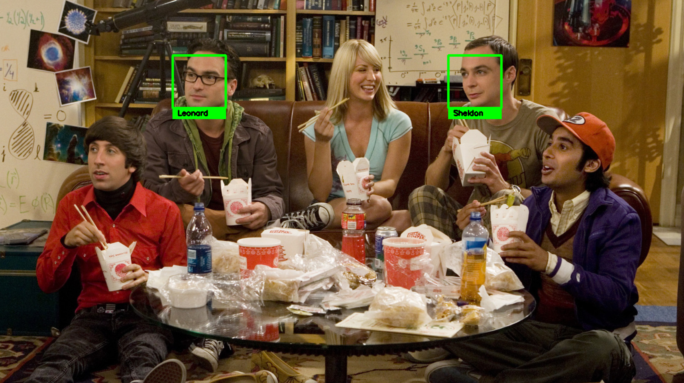
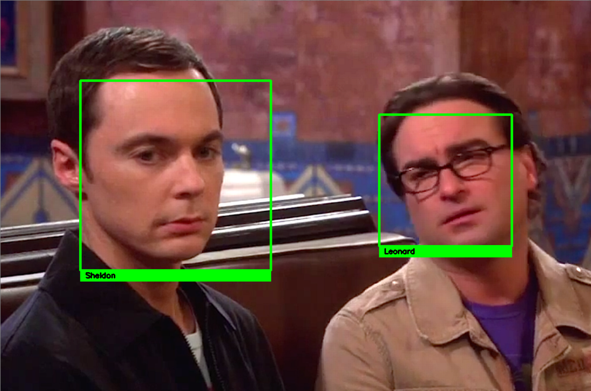

# Face_Recognition_OpenCV
Face detection and recognition module using the face_recognition library

## Overview

This python script provides the necessary code to perform facial recognition on images, video as well as on live webcam feed.

## Arguments
```
-v/--video     ---->  Path to video file  
-u/--users     ---->  Path to user images  
-i/--image     ---->  Path to the folder containing test images  
-c/--camera    ---->  To use the live feed from web-cam  
-m/--model     ---->  Choose the model to use, choices=['hog', 'cnn']
-t/--tolerance ---->  Tolerance value for the model
```

## Usage

* For using the webcam feed  
`python face_recognition.py --users <path to the folder containing user images>`

* For testing on images in a folder  
`python face_recognition.py --users <path to the folder containing user images> --camera False --images <path to the folder containing test images>`

* For testing on a video file  
`python face_recognition.py --users <path to the folder containing user images> --camera False --video <path to the video file>`


## Sample Output

          

## Notes

1. The program uses "hog" (Histogram of Oriented Gradients) by default to perform facial recognition.
But, if your system has GPU support you can use the "cnn" (Convolutional Neural Network) model to do the same.

2. Take a look at the `requirement.txt` file for the required libraries and dependencies.

3. The folder containing user images should be structured as below:

```
User_Faces/
    --User1/
        --image1
        --image2
        .
        .
    --User2/
        --image1
        --image2
        .
        .
```

## Future Updates
1. To add option to save images and videos to the desired path.

2. Employ voting mechanism to decide best match.


If you have any queries, feel free to ask them. I'll do my best to answer. :)

Happy Learning People ! Keep chasing your dreams ! ⭐️
